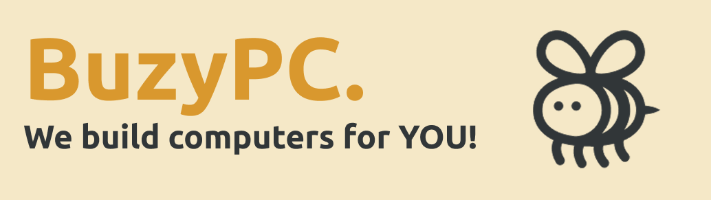

# BuzyPC

## Project Overview
Badly need a PC? Have a limited budget? BuzyPC will provide you a PC build on your own terms!

This project is a mock-up of what the true application should expectedly function.
XML is used for UI layouts and Kotlin for logic. Jetpack Compose is **not** used in this project. 

## Table of Contents
- [Screenshots](#screenshots)
- [Tech Stack](#tech-stack)
- [Contributing](#contributing)
- [Final Message](#final-message)

---

## Screenshots

---

## Tech Stack
- **Language**: Kotlin
- **UI Framework**: XML-based layouts
- **AI**: GPT-4.1

---

## Contributing
1. Clone the repository.
2. Create a feature branch (`dev/feature/your-feature`).
3. Fragment your code changes into specific purposes. 
Avoid making a large commit that span across multiple files with different purposes.
4. Commit changes with clear messages.
5. Push and create a pull request.

---

## Final Message
In compliance with CSIT284 - Platform-based Development 3 (Mobile) S.Y. 2024-2025 2nd Semester. All Rights Reserved.

END.
